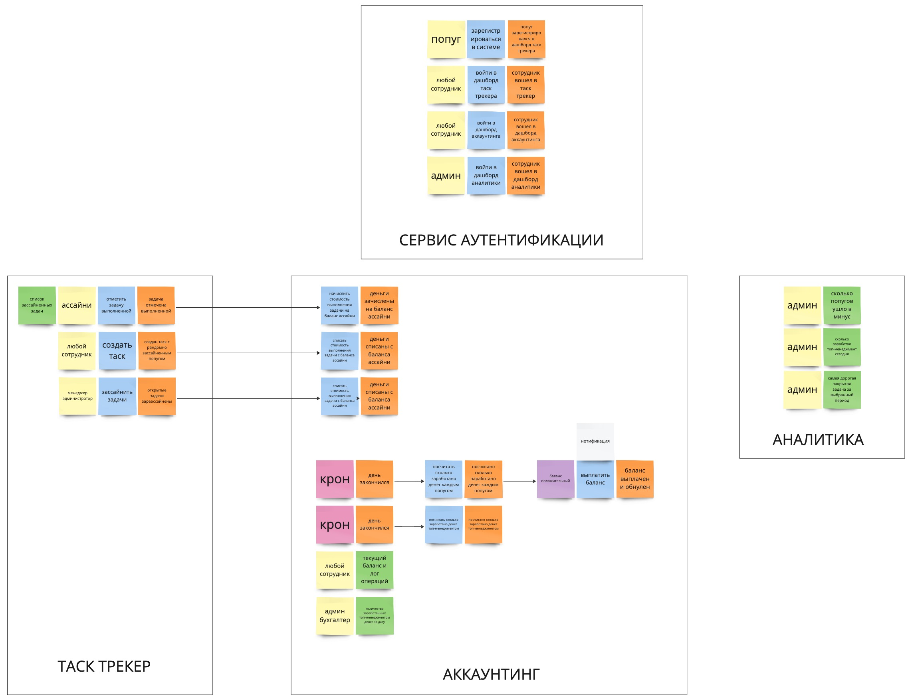
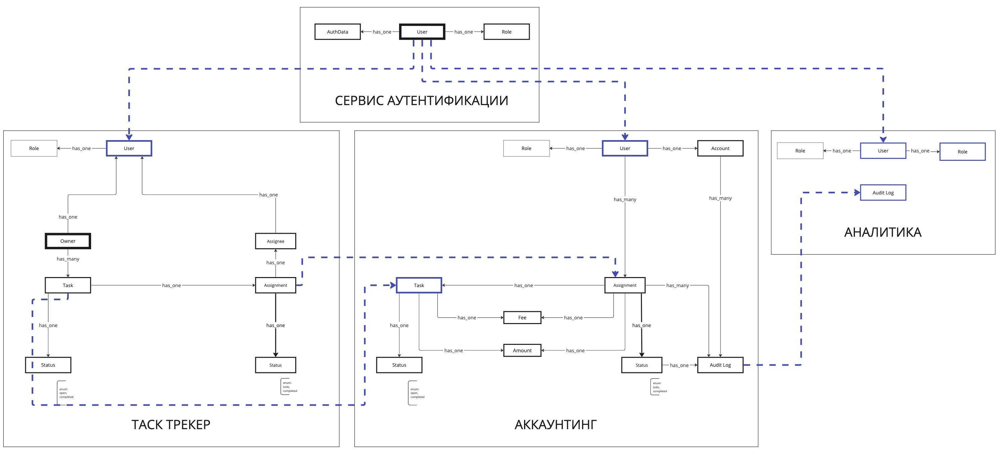
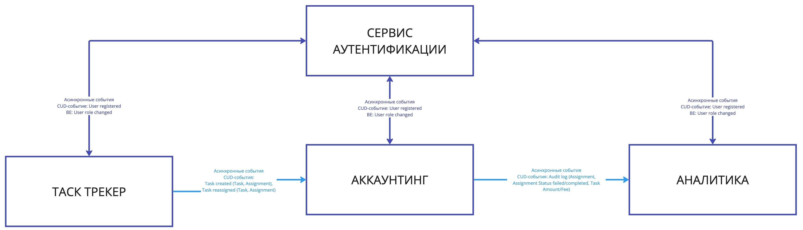

# Week 1

## Event storming

[See full size event storming image](event-storming.pdf)

## Модель данных

[See full size data model image](data-model.pdf)

## Домены
1. Core: Увеличение производительности сотрудников (основная проблема)
2. Core: Авторизация/аутентификация (Инновационная система авторизации по клюву)
3. Core: Развитие сотрудников (инновационная система ассайна)
4. Generic: Повышение мотивации сотрудников - supporting (аккаунтинг)
5. Аналитика - generic

## Сервисы
1. Сервис аутентификации = домен аутентификации - выделен отдельно, так как это единая точка входа для всей компании UberPopug Inc.
2. Сервис таск-трекер объединяет в себе несколько доменов: увеличение производительности сотрудников, развитие сотрудников
3. Сервис аккаунтинга - повышение мотивации сотрудников
4. Сервис аналитики

## Communications

[See full size communications image](communications.pdf)

### Sync communications
- CUD событие: Пользователь зарегистрирован (ID, Role)
- Бизнес событие: Роль изменилась (ID, Role)

### Async communications
CUD события:
- Счет открыт (Account)
- Таск создан (Task, Assignment, Amount, Fee)
- Таск реассайнут (Task, Assignment)
- Таск выполнен (Task, Assignment)

Assignment содержит в себе инфу об исполнителе и статусе.
